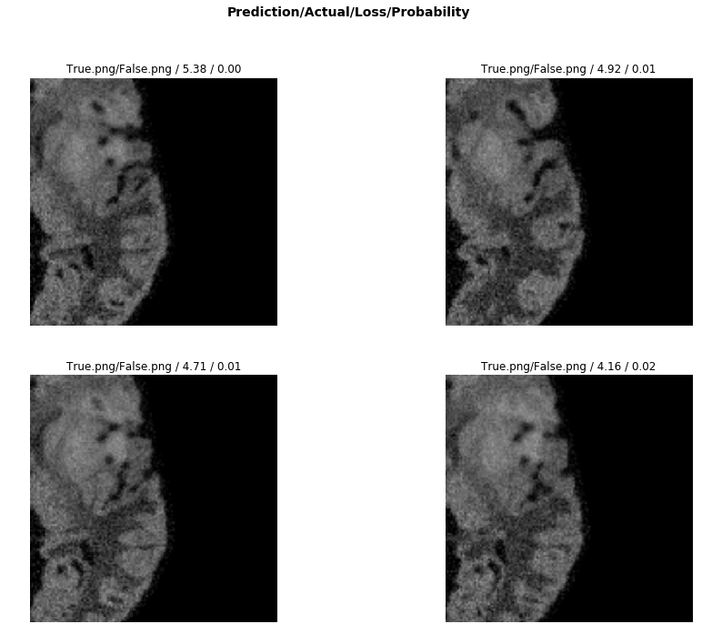
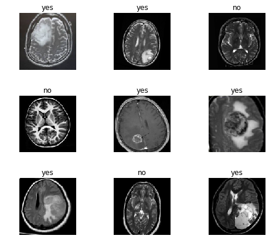

# Brain Tumor Detection using Transfer Learning

## Data
The data was obtained from the MICCAI 2013 Challenge on Multimodal Brain Tumor Segmentation

* Menze et al., The Multimodal Brain Tumor Image Segmentation Benchmark (BRATS), IEEE Trans. Med. Imaging, 2015.

### Training / Validation

**Train**: LabelList (2125 items) of ImageList (256, 256, 3)

**Valid**: LabelList (1415 items) of ImageList (256, 256, 3)

## Metric

Dice Coefficient: 

### Results

The FCN (Fully Convoluted Network) obtained a **dice "score" of 0.88**

## Model
The machine learning model relies on transfer learning from resnet 50. 
The basic principle is to keep all the convolutional layers with their weights pretrained. 

We then only train the head of the model initially. Later, we unfreeze the layers and start the process of fine-tuning using differential learning rates.

### Progressive Resizing

Progressive resizing was used, where an image size of 64 was first trained, and then those weights were applied to the upscaling of image size 128. This was done progressively until an image size of 256. 

## Web Application

The following web application was built using Flask. A lightweight API is built that loads the model from a pkl file. When a user uploads an image, the image is pre-processed and then run through the model to obtain a prediction.

This prediction, and probability of class is then passed to a render template. 

### Later Work

Future work would include separation of concerns, where the front end server runs React, while the backend server runs Flask with a lightweight API with simple endpoints that return JSON.

For segmentation, the architecture is best changed to u-net which is better designed for biomedical imaging segmentation

### FLAIR
Currently, this model only classifies Fluid-attenuated inversion recovery (FLAIR) segmentations. 

## BrainAI

Dependencies:
- fast.ai 
- flask
- tailwind

### Landing Page

### Predict

### Results

## Note

Due to size limitations on Github, the pkl file was left in a .gitignore. The model was trained and tuned using resnet50 along with fastai libraries and factory functions. It was necessary to use cloud GPU services, and in this case, Paperspace Gradient was used. 

The model was trained on an Nvidia Quadro P4000 with 8 GB of GDDR5 and 1792 CUDA cores.

Additionally, I would have liked to incorporate the other segmentation images besides FLAIR. Integrating t1c and t2 images, along with segmentation slices would be a much more robust classification for multi-modal brain imaging.
